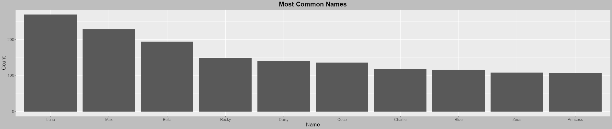
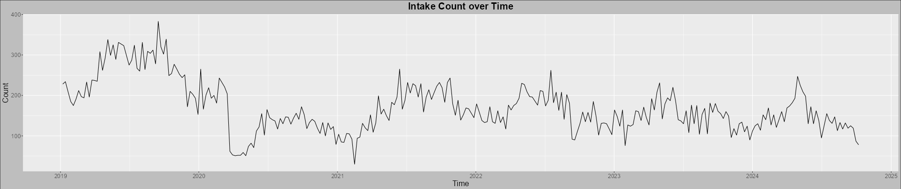
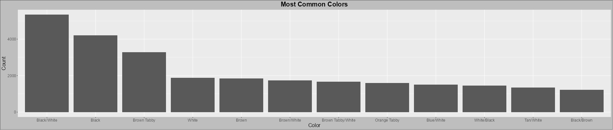

```{r setup, echo=FALSE}
knitr::opts_chunk$set(
  engine.path = list(
    python = "D:/Programming/Languages/Python/py-3.11.3/"
  ),
  python.reticulate = FALSE
)
```

### Abstract

|     Throughout the United States, animal shelters are constantly facing the critical problem of overcrowding in an already crowded kennel situation. One such example of a place this problem continually effects lies in the Austin Animal Center, the municipal animal shelter which serves the city of Austin, Texas. This shelter, despite maintaining one of the best no-kill statuses in the country, is constantly operating beyond its means as a result of the extreme surplus of stray and surrendered animals. These strays tend to come from puppy mills and breeding rings that breed them for money, but end up operating out of their own means and eventually resort to abandonment. The remainder that aren't escape artists generally come from abusive and neglectful households that simply no longer wanted them. This problem is devastating to cities around the country as it causes a high rate of stray dogs and cats getting sick, attacked, injured, or perhaps most upsetting, euthanized by shelters. 
|     Based on the data collected in this report, dogs tend to make up the bulk of the overcrowding problem, however cats tend to follow shortly behind. On average, roughly 150 animals are taken in each week at the shelter into a facility that only contains 252 dog kennels, and a smaller number of cat kennels, indicating the shelter likely won't be able to keep up forever without additional extreme measures. Despite a noticeable drop in intake numbers from 2019-2020, the problem is still significant and the shelter is now struggling to the point of recently being forced to close intakes and consider abandoning their goal of maintaining a 95%+ no-kill rate (Moreno-Lozano, 2024). As a result, people that have a legitimate reason for surrendering their animal are being turned away and more animals are at risk of euthanasia in Austin than have been in recent memory. After analyzing the data, it is clear that some improvements to the situation may exist, such as increasing the amount of animal care assistance provided to certain regions of Austin that are indicated to be hotspots. Some seasonal approaches may be taken as well, such as increasing animal care awareness in the summer months, which is when intakes tend to peak.

### Introduction

|     The data utilized in the creation of this report comes from the City of Austin Open Data Portal ([City of Austin Open Data Portal](https://data.austintexas.gov/), n.d.), which holds information and data metrics publicized by the local City of Austin government. Two such datasets were obtained from this portal and utilized, namely the Austin Animal Center Intakes and Outcomes sets ([City of Austin Open Data Portal](https://data.austintexas.gov/browse?q=animal), n.d.). These datasets come directly from the shelter's internal management and provide info on each individual intaken and outtaken from the shelter on a daily basis. 
|     The datasets used were obtained on October 14th, 2024, and contain 167,913 intake entries and 167,844 outcome entries. Each dataset contains 12 columns, which include overlapping columns such as animal ID, name, and animal type, but contain unique columns such as intake type vs outcome type and intake condition vs outcome subtype. These unique features can be used to draw trends and patterns from the shelter and potentially provide an insight into how the shelter operates on a regular basis, and what things may be able to be improved. My interest in this data springs from my own experiences working at the Humane Society of Central Texas, and experiencing first hand the tough calls that have to be made on intakes, outcomes, and euthanasia decisions, medically or behaviorally influenced or not. This dataset gives me the opportunity to view how a much larger operation is able to consistently stay afloat while constantly battling struggles.

### Data Cleaning

|     In order to create a cohesive dataset that could be easily analyzed, visualized, and utilized to trace an animal's history, the two datasets were merged together by the animal ID column, something that is unique to each animal that passes through the animal center. The columns were then pruned, renamed, and organized, and additional geocoding columns were added. Entries were then filtered to only include data from 01-01-2019 until the data retrieval date, and entries with missing animal IDs or ages were removed. As a result of the merging process, many duplicate entries existed and were subsequently filtered via a sort and keep algorithm to only include the valid entries (see L54-83 in buildDataset.R). The ages in the dataset were then converted to a numeric format, and any invalid age values were removed from the dataset. Following the primary data cleaning process, a geocoding script (see geocode.py) was run repeatedly over the course of three weeks to retrieve the latitude and longitude of the address attached to each animal ID entry. This process resulted in a dataframe containing 21 variables for all 51,361 entries, which would contain 25,101 entries once entries with invalid geocoding parameters were removed.

### Exploratory Data Analysis

```{r heatmap-types, echo=FALSE, fig.cap="Heatmap with points of all intake locations; Pie chart of all animal types recorded", fig.align="center", fig.show="hold", out.width="49%", out.height="30%"}
knitr::include_graphics(c("../img/heatmap.png", "../img/types.png"))
```

```{r names, echo=FALSE, fig.cap="Bar chart displaying most common animal names", fig.align="center", out.width="100%", out.height="25%"}

```

\pagebreak

### Analysis and Results

|     The heatmap in figure 1 was made interactive in the Shiny app to allow for a deep analysis of any correlations between locations across the Austin Animal Centers jurisdiction and the number of intakes. The markers were added on top of the heatmap intentionally, in order to allow the analyst or viewer to manually check certain statistics of animals found in a certain region. Additionally, these layers are toggleable, allowing for a map with only the heatmap layer or a map with solely the placed markers.

```{r heatmap-zooms, echo=FALSE, fig.cap="Zoomed in regions of the marked heatmap with high intake density", fig.align="center", fig.show="hold", out.width="49%", out.height="30%"}
knitr::include_graphics(c("../img/heatmapZoom1.png", "../img/heatmapZoom2.png"))
```

|     This figure, being interactive and detailed, provides a significant amount of information regarding the correlation between intake density and location, as well as population density and intake density. Cross-referencing a zip-code map and the interactive intake map allows for the identification of some of the highest intake density zip-codes, with some being identified as 78723, 78741, 78752, and 78758. Some lower intake density zip-codes have also been identified at 78749 and 78759. These zip-codes can be further utilized to investigate potential correlations between intake density and population density, or other potential disadvantages, such as a lack of animal care resources or awareness in these areas. Some of this investigation has been performed in the table below.

| Location        | Pop./$mi^2$ | Median Household Income |
| --------------- | ----------- | ----------------------- |
| **78723** *(h)* | 4,083       | \$42,939                |
| **78741** *(h)* | 5,915       | \$30,871                |
| **78749** *(l)* | 2,794       | \$66,828                |
| **78752** *(h)* | 5,403       | \$34,716                |
| **78758** *(h)* | 4,747       | \$43,537                |
| **78759** *(l)* | 3,421       | \$84,907                |
| **US Avg.**     | 91          | \$80,610                |

|     More connections could likely be uncovered by more variable analysis between the varying intake density zip-codes. However, a clear pattern emerges in the difference of higher and lower intake zip-codes. Population density tends to be lower in low intake zip-codes, and median household income is significantly higher than the median in high intake zip-codes. These correlations lend their hand to the argument of the need for more animal welfare education within the densest and lower income areas of the city of Austin, as the problem could be improved by the addition of more resources to these communities. Aside from education, an increase in crackdowns on animal breeding and fighting rings would also likely influence the intake densities, as many of these dogs are likely entering the shelter as puppies or as injured fighting and bait dogs.

\pagebreak

|     Furthermore, a line plot was created in order to demonstrate the fluctuation of animal intakes between certain times and seasons of the year. The plot presents ranges of data from 01-01-2019 until 10-14-2024, and is also given a path by the weekly intake count measurements rather than each day being plotted. An option for a line path by daily points is included in the shiny app, but it displays a quite difficult to read plot. While this line plot could be improved by adding a modeled curve or additional information to contrast with, the intake count over time is modeled well enough to draw some conclusions.

```{r line-plot, echo=FALSE, fig.cap="Line plot demonstrating the fluctuation of intakes over the last five years", fig.align="center", out.width="100%", out.height="20%"}

```

|     As seen in figure 4, there is a noticeable drop in weekly intake count around spring time of 2020, which happens to coincide with the base incidence of the COVID-19 pandemic in the United States. This likely resulted in a decrease in permitted intakes by the shelter due to a lack of adoptions and fosters available, as well as a possible decrease in stray patrolling and breeding ring operations. However, despite the marked average decrease of nearly 150 animals weekly from 2019 to the subsequent years, the pattern of intake peaks in late spring and summer are very consistent. This likely indicates a lack of animals being secured by their owners during the warmer months of the year, resulting in a higher stray population. Also supporting this hypothesis is the troughs evident in the colder months of the year, mainly found around December and January. Additionally, many of these escaped animals are likely not microchipped, therefore increasing the probability of them not being found by their owners post-escape. This easily ties into the previous argument of the need for more animal welfare education and resources in the City of Austin, as education on proper pet care and security and the importance of microchipping could significantly decrease the intake count during the high intake, or warmer, months of the year.

|     Referencing back to the pie chart in figure 1, animal types over a certain time range were also measurable, and the measurement of the full dataset indicated that dogs are the most intaken animals at the shelter, with easily 25,000 results available. Following next in intakes are cats, with likely around 20,000 results presented. This adds a new element to the animal welfare in Austin, as dogs, while being the primary and more difficult issue, are trailed very shortly in intake by cats, another animal that deserves equally as much attention and care. As echoed throughout this report, proper education on animal welfare is a necessary aspect of reducing animal overcrowding in a city. With education and resources on how to keep your cat safe, indoors, and not in a shelter like Austin Animal Center, the intakes would likely be marginally reduced. 

```{r colors, echo=FALSE, fig.cap="Bar chart displaying most common animal colors", fig.align="center", out.width="100%", out.height="15%"}

```

|     Lastly, the bar chart in figure 2 as well as in figure 5 present less significant information in context of the problem at hand, however the information is interesting to view regardless. Names like Luna, Max, and Bella find themselves at the top of the most common names for animals that have entered the Austin Animal Center. The most common animal colors are black and white, black only, and brown tabby cats in specific. White this information likely has no influence on the issue of animal overcrowding, it is indicative of the tendency of people to follow trends and the culture surrounding them, potentially tying in to the tendency of people following suit in a lack of understanding of animal welfare.

|     As echoed consistently, the problem of animal overcrowding in Austin is likely to not get better unless change in animal welfare education and resources are made. With changes like these made, intake density in certain zip-codes will decrease and therefore lower the load-bearing weight required by the Austin Animal Center. Additionally, a deeper breakdown of how breeding rings are operating and how to effectively interrupt their operations is key to the mission of reducing stray, injured, and traumatized animals on this streets. This problem is not only faced by the Austin Animal Center however, but is faced by shelters all over the country, in large places like Austin and Houston, but also in smaller places such as our very own Waco. Despite the constructive criticisms of the Austin animal welfare programs in this report, they excel at their jobs regardless, continuing to maintain one of the highest no-kill ratios in the country for a shelter of its size and magnitude. The correlations and conclusions drawn from this analysis and report serve solely to provide a better look into the world of animal welfare, and to hypothesize on actions that could be taken to improve the situations that cities like Austin find themselves in.

\pagebreak

### Appendix

***./buildDataset.R:***
```{r buildDataset, eval=FALSE}
library(dplyr)
library(fields)
library(lubridate)

# - load/merge data -
intakes <- read.csv("dat/aac_intakes.csv")
outcomes <- read.csv("dat/aac_outcomes.csv")
aac_dataset <- merge(intakes, outcomes, by = "Animal.ID", all.x = TRUE)

# - data wrangling -

# remove redundant columns
aac_dataset[, c("Name.y", "Animal.Type.y", "Breed.y", "Color.y")] <- NULL

# more sensible column names
colnames(aac_dataset) <- c(
  "AID", "name", "inDateTime", "inDate",
  "address", "inType", "inCond", "animalType",
  "inSex", "inAge", "breed", "color",
  "outDateTime", "outDate", "DOB", "outType",
  "outSubtype", "outSex", "outAge"
)

# add lat/lon columns
aac_dataset$lat <- NA
aac_dataset$lon <- NA

# more sensible column organization (important for data exploration)
aac_dataset <- aac_dataset[, c(
  "AID", "name", "animalType", "breed",
  "color", "DOB", "inDateTime", "inDate",
  "address", "lat", "lon", "inType",
  "inCond", "inSex", "inAge", "outDateTime",
  "outDate", "outType", "outSubtype", "outSex",
  "outAge"
)]

# restrict to time frame of last 5 years
aac_dataset <- aac_dataset[
  as.numeric(gsub("\\D", "", aac_dataset$inDate)) >= 2019,
]
aac_dataset <- aac_dataset[
  as.numeric(gsub("\\D", "", aac_dataset$outDate)) >= 2019,
]

# remove entries with no identifier or age metric ability
aac_dataset <- subset(aac_dataset, !is.na(AID) & !is.na(inAge))

# set proper column typing
aac_dataset$inDateTime <- mdy_hms(aac_dataset$inDateTime)
aac_dataset$outDateTime <- mdy_hms(aac_dataset$outDateTime)
aac_dataset$DOB <- mdy(aac_dataset$DOB)

# match duplicated entries to the correct intake/outcome pairing
filter_group <- function(group) {
  entries <- nrow(group)
  actual <- sqrt(entries)

  # this removes any contaminated entries that likely wouldn't be able to be
  # interpreted correctly without human intervention as a result of an outcome
  # entry that is missing its intake entry due to the time frame restriction
  if (actual != floor(actual)) return(data.frame())

  # actual = 2; keep = 1, 4
  # actual = 3; keep = 1, 5, 9
  # actual = 4; keep = 1, 6, 11, 16
  # y = (a*(i-1)) + i
  keep <- numeric(actual)
  for (i in 1:actual) {
    keep[i] <- (actual * (i - 1)) + i
  }

  return(group[keep, ])
}

matched_data <- aac_dataset |>
  group_by(AID) |> # internally group each AID
  filter(n() > 1) |> # keep only duplicates in this pipe
  arrange(AID, inDateTime, outDateTime) |> # sort by these cols, in this order
  group_modify( # apply function that filters out bad duplicates
    ~ filter_group(.x)
  ) |>
  ungroup() # return to standard form w/o groups

# convert ages to usable decimal format
conv_age <- function(ages) {
  ages <- sapply(ages, strsplit, " ")
  ages <- sapply(ages, function(age) {
    if (length(age) != 2) return(-1)

    age_num <- as.numeric(age[[1]])
    age_scope <- age[[2]]

    return(
      switch(
        age_scope,
        "years" = age_num,
        "months" = age_num / 12,
        "weeks" = age_num / 52.143,
        "days" = age_num / 365,
        -1
      )
    )
  })
  ages <- sapply(ages, round, digits = 3)

  return(ages)
}

# perform all modifications on primary dataset
aac_dataset <- aac_dataset |>
  group_by(AID) |>
  filter(n() == 1) |> # keep only unique values in this pipe
  ungroup() |>
  bind_rows(matched_data) |> # append all matched duplicate entries to main data
  arrange(AID) |> # sort after having added duplicates to bottom of dataframe
  mutate(across(c(inAge, outAge), conv_age)) |> # convert ages to decimal format
  filter(inAge != -1 & outAge != -1) # remove invalidated entries

# add lat/lon (must run geocoding section below + .py script first)
geocoded <- read.csv("dat/geocoded_addrs.csv")[-1, ]
fill_inc <- rep(-1, nrow(aac_dataset) - length(geocoded$lat))
aac_dataset$lat <- c(geocoded$lat, fill_inc)
aac_dataset$lon <- c(geocoded$lon, fill_inc)

save(aac_dataset, file = "dat/aac_dataset.rda")

# - geocoding -

# create data subset for geocoding, if it doesn't already exist
if (!file.exists("dat/raw_addrs.csv")) {
  geo_subset <- aac_dataset %>%
    mutate(idx = row_number()) %>%
    select(idx, AID, address)
  write.csv(geo_subset, "dat/raw_addrs.csv", row.names = FALSE)
}

# create csv file for geocoded results, if it doesn't already exist
if (!file.exists("dat/geocoded_addrs.csv")) {
  base_df <- data.frame(
    idx = 0, AID = 0, address = "AAC",
    lat = 30.2521117, lon = -97.6872072
  )
  write.csv(base_df, "dat/geocoded_addrs.csv", row.names = FALSE)
}
```

\pagebreak

***./app.R:***
```{r app, eval=FALSE}
library(bslib)
library(dplyr)
library(DT) # data explorer
library(ggplot2) # visualizations
library(leaflet) # interactive map
library(leaflet.extras)
library(lubridate)
library(shiny)

load("dat/aac_dataset.rda")

default_theme <- theme(
  plot.background = element_rect(fill = "grey", color = "black"),
  plot.title = element_text(size = 20, face = "bold", hjust = 0.5),
  axis.title = element_text(size = 16),
  axis.text = element_text(size = 12)
)

aac_dataset_full <- aac_dataset
aac_dataset_geo <- aac_dataset |> filter(lat != -1 & lon != -1)

toggle <- function(switch) {
  if (switch) {
    aac_dataset <<- aac_dataset_full
  } else {
    aac_dataset <<- aac_dataset_geo
  }
}

get_plot <- function(input) {
  if (is.null(input$plotName)) return(ggplot() + default_theme)
  
  switch(
    input$plotName,

    "Intake over Time" = {
      filtered <- aac_dataset |>
        filter(
          inDateTime >= ymd(input$xTimeRange[1]) &
            inDateTime <= ymd(input$xTimeRange[2])
        )

      in_tbl <- table(as.Date(filtered$inDateTime)) |>
        as.data.frame() |>
        setNames(c("inDateTime", "Count")) |>
        mutate(inDateTime = as.Date(inDateTime))

      if (input$xTimeFrame == "Weekly") {
        in_tbl <- in_tbl |>
          mutate(inDateTime = week(inDateTime) + (
            52 * (year(inDateTime) - year(ymd(input$xTimeRange[1])))
          )) |>
          aggregate(Count ~ inDateTime, sum) |>
          mutate(inDateTime = ymd(input$xTimeRange[1]) + (7 * inDateTime - 1))
      }

      in_tbl |>
        ggplot(aes(inDateTime, Count, group = 1)) +
        ggtitle("Intake Count over Time") +
        xlab("Time") +
        default_theme +
        geom_line() +
        scale_x_date(breaks = scales::pretty_breaks(n = 10))
    },

    "Most Common Names" = {
      name_tbl <- head(
        sort(table(aac_dataset$name), decreasing = TRUE),
        input$nameCount + 1
      )[-1]

      name_tbl |>
        as.data.frame() |>
        setNames(c("Name", "Count")) |>
        ggplot(aes(Name, Count)) +
        ggtitle("Most Common Names") +
        default_theme +
        geom_col()
    },

    "Most Common Colors" = {
      color_tbl <- head(
        sort(table(aac_dataset$color), decreasing = TRUE),
        input$colorCount
      )

      color_tbl |>
        as.data.frame() |>
        setNames(c("Color", "Count")) |>
        ggplot(aes(Color, Count)) +
        ggtitle("Most Common Colors") +
        default_theme +
        geom_col()
    },

    "Animal Types over Time Range" = {
      filtered <- aac_dataset |>
        filter(
          inDateTime >= ymd(input$pieTimeRange[1]) &
            inDateTime <= ymd(input$pieTimeRange[2])
        )

      type_tbl <- sort(table(filtered$animalType), decreasing = TRUE)

      custom_theme <- theme(
        plot.background = element_rect(fill = "grey", color = "black"),
        plot.title = element_text(size = 20, face = "bold", hjust = 0.5),
        axis.text = element_text(size = 12)
      )

      type_tbl |>
        as.data.frame() |>
        setNames(c("Type", "Amount")) |>
        ggplot(aes(x = "", y = Amount, fill = Type)) +
        theme_void() +
        ggtitle("Animal Types over Time Range") +
        custom_theme +
        geom_bar(stat = "identity", width = 1) +
        coord_polar("y", start = 0)
    },

    # - default -
    ggplot() +
      default_theme
  )
}

ui <- navbarPage(
  title = "Austin Animal Center Data",
  id = "nav",

  tabPanel(
    title = "Data Explorer",
    fluidRow(
      column(4, # age
        sliderInput("age", "Age", min = 0, max = 30, value = c(0, 30))
      ),
      column(4, # animal type
        selectInput(
          "animalType", "Animal Type",
          choices = c("All types" = "", sort(unique(aac_dataset$animalType)))
        )
      ),
      column(4, # breed
        conditionalPanel(
          "input.animalType != ''",
          selectizeInput(
            "breed", "Breed", choices = c("All breeds" = ""), multiple = TRUE
          )
        )
      )
    ),
    fluidRow(
      column(4, # inType
        selectInput(
          "inType", "Intake Type",
          choices = c("All types" = "", sort(unique(aac_dataset$inType))),
          multiple = TRUE
        )
      ),
      column(4, # outType
        selectInput(
          "outType", "Outcome Type",
          choices = c("All types" = "", sort(unique(aac_dataset$outType))),
          multiple = TRUE
        )
      ),
      column(4, # column selector
        selectInput(
          "columns", "Columns",
          choices = c("All columns" = "", colnames(aac_dataset)),
          selected = "", multiple = TRUE
        )
      )
    ),
    hr(),
    DTOutput("aac_dataset")
  ),

  tabPanel(
    title = "Interactive Map",
    leafletOutput("map", width = "100%", height = "93vh")
  ),

  tabPanel(
    title = "Visualizations",
    fluidRow(
      column(3,
        wellPanel(
          h3("Select a Plot"),
          radioButtons(
            "plotName", "Options:",
            choices = c(
              "Intake over Time", "Most Common Names",
              "Most Common Colors", "Animal Types over Time Range"
            ),
            selected = character(0)
          )
        ),
        conditionalPanel(
          "input.plotName",
          wellPanel(
            h3("Plot Options"),
            conditionalPanel(
              "input.plotName == 'Intake over Time'",
              dateRangeInput(
                "xTimeRange", "Time Range to Measure",
                start = min(aac_dataset$inDateTime),
                min = min(aac_dataset$inDateTime),
                end = max(aac_dataset$inDateTime),
                max = max(aac_dataset$inDateTime)
              ),
              radioButtons(
                "xTimeFrame", "Time Frame",
                choices = c("Daily", "Weekly")
              )
            ),
            conditionalPanel(
              "input.plotName == 'Most Common Names'",
              sliderInput(
                "nameCount", "How many names should be charted?",
                min = 3, max = 25, value = 10
              )
            ),
            conditionalPanel(
              "input.plotName == 'Most Common Colors'",
              sliderInput(
                "colorCount", "How many colors should be charted?",
                min = 3, max = 25, value = 10
              )
            ),
            conditionalPanel(
              "input.plotName == 'Animal Types over Time Range'",
              dateRangeInput(
                "pieTimeRange", "Time Range to Measure",
                start = min(aac_dataset$inDateTime),
                min = min(aac_dataset$inDateTime),
                end = max(aac_dataset$inDateTime),
                max = max(aac_dataset$inDateTime)
              )
            )
          )
        )
      ),
      column(9,
        plotOutput("plot")
      )
    )
  ),

  tabPanel(
    title = "Settings",
    wellPanel(
      h3("Dataset Settings"),
      input_switch(
        "geo_switch", "Allow data with missing geolocation info?", value = TRUE
      )
    )
  )
)

server <- function(input, output, session) {
  # - data explorer -
  observe({
    breeds <- if (input$animalType == "") character(0) else {
      sort(
        unique(aac_dataset$breed[aac_dataset$animalType %in% input$animalType])
      )
    }

    updateSelectizeInput(
      session, inputId = "breed",
      choices = breeds,
      server = TRUE
    )
  })

  output$aac_dataset <- renderDT({
    df <- aac_dataset |> filter(
      inAge %in% input$age[1]:input$age[2],
      outAge %in% input$age[1]:input$age[2],
      input$animalType == "" | animalType %in% input$animalType,
      is.null(input$breed) | breed %in% input$breed,
      is.null(input$inType) | inType %in% input$inType,
      is.null(input$outType) | outType %in% input$outType
    )
    
    if (!is.null(input$columns)) df <- df[, input$columns]

    return(df)
  }) |>
    bindEvent(
      input$age, input$animalType, input$breed,
      input$inType, input$outType, input$columns,
      input$geo_switch
    )

  # - interactive map -
  output$map <- renderLeaflet({
    leaflet(aac_dataset_geo) |>
      addTiles(group = "OSM") |>
      addProviderTiles("CartoDB.Voyager", group = "Simplified") |>
      addProviderTiles("Esri.WorldTopoMap", group = "Topographic") |>
      addHeatmap(
        group = "Heatmap", lat = ~lat, lng = ~lon,
        max = 0.95, blur = 30, radius = 20
      ) |>
      addAwesomeMarkers(
        group = "Points", lat = ~lat, lng = ~lon,
        clusterOptions = markerClusterOptions(),
        popup = ~paste(
          "<h4><strong>", name, " (", AID, ")</strong></h4>",
          "<hr/>",
          "Type: ", animalType, " - ", breed, "<br/>",
          "Age: ", inAge, "<br/>",
          "Intake Datetime: ", inDateTime, "<br/>",
          "Intake Type: ", inType, "<br/>",
          "Intake Condition: ", inCond, "<br/>"
        )
      ) |>
      addLayersControl(
        baseGroups = c("OSM", "Simplified", "Topographic"),
        overlayGroups = c("Heatmap", "Points")
      ) |>
      addMiniMap(toggleDisplay = TRUE) |>
      setView(lat = 30.26, lng = -97.745, zoom = 11)
  })

  # - visualizations -
  output$plot <- renderPlot({
    get_plot(input)
  })

  # - settings -
  observe({
    toggle(input$geo_switch)
    output$plot <- renderPlot({
      get_plot(input)
    })
  }) |> bindEvent(input$geo_switch)
}

shinyApp(ui = ui, server = server)
```

\pagebreak

***./geocode.py:***
```{python geocode, eval=FALSE}
from csv import QUOTE_NONNUMERIC
from datetime import datetime
from dotenv import load_dotenv
from os import getenv
from requests import get
from time import sleep
import logging
import numpy as np
import pandas as pd
import re


class Geocoder:
    key: str | None
    count: int | None
    wait: float | None
    raw_df: pd.DataFrame
    out_df: pd.DataFrame

    def __init__(self) -> None:
        load_dotenv()
        self.key = getenv("GEOCODE_API_KEY")

        self.count = None
        self.wait = None

        self.raw_df = pd.read_csv("dat/raw_addrs.csv")
        self.out_df = pd.read_csv("dat/geocoded_addrs.csv")

    @staticmethod
    def _get_var( 
        prompt: str, 
        default: float, 
        vRange: range | np.ndarray,
        exc_msg: str
    ) -> float:
        var = None

        while not isinstance(var, float) or var not in vRange:
            var = input(prompt)

            try:
                if var in ['', ' ']:
                    var = default
                else:
                    var = float(var)
            except ValueError:
                var = None
                print(exc_msg)
            else:
                print(exc_msg) if var not in vRange else None

        return var

    def _run_startup_tasks(self) -> None:
        self.count = int(
            self._get_var(
                "How many addresses should be geocoded [default = 1000/day, max = 5000/day]? ", 
                1000.0, range(1, 5001), "Please enter a number between 1 and 5000."
            )
        )

        self.wait = self._get_var(
            "How long should the script wait between requests [default=1.2s, max=30s]? ", 
            1.2, np.linspace(1, 30, num=2901), "Please enter a number between 1 and 30."
        )


    def _check_max(self) -> bool:
        current_date = datetime.today().strftime("%m-%d-%y")

        with open("./run-list.log", "a+") as logfile:
            logfile = logfile.readlines()
        
        queries = 0
        for line in logfile:
            if current_date in line:
                queries += int(re.search("\\d{1,}", line).group(0))

        if queries >= 5000:
            return False
        else:
            return True

    def _log_run(self, count: int) -> None:
        logging.basicConfig(
            filename="./run-list.log", filemode='a',
            format="%(asctime)s | %(name)s | %(levelname)s | %(message)s",
            datefmt="%m-%d-%Y", level=logging.INFO
        )
        logging.info(f"Running {count} queries.")   

    def _geocode(self, address: str) -> tuple[float, float] | int:
        req = get(f"https://geocode.maps.co/search?q={address}&api_key={self.key}")

        if req.status_code == 401:
            return -2

        if req.status_code == 429:
            return -1

        if len(req.json()) != 0: # successful query for coordinates
            data = req.json()[0]
            return (
                round(float(data['lat']), 6), 
                round(float(data['lon']), 6)
            )
        else: # if len is 0, then the request was bad and yielded no coordinates
            return (-1, -1)

    def run(self) -> None:
        if not self._check_max():
            print("Daily query limit reached!")
            return

        self._run_startup_tasks()
        self._log_run(self.count)

        start_idx = int(self.out_df.tail(1)["idx"].values[0]) + 1 
        end_idx = start_idx + self.count
        new_rows = [] 

        for idx in range(start_idx, end_idx):
            row = self.raw_df.query("idx == @idx") # find row with matching idx
            base_addr = row["address"].values[0]

            if base_addr != "Outside Jurisdiction" and re.match("\\d", base_addr):
                # regexes to format addr for GET request
                addr = re.sub("[()]", "", base_addr)
                addr = re.sub("\\Win\\W", " ", addr)
                addr = re.sub("\\W", "+", addr)
                coords = self._geocode(addr)
            else:
                coords = (-1, -1)

            print(
                f"{(idx)}/{end_idx-1} ({idx-start_idx+1}) | {row['AID'].values[0]} - {coords}"
            )

            if coords == -1: # we've hit the request limit, end geocoding
                print(
                    f"Request limit exceeded! Prematurely terminating script @ idx {idx}"
                )
                break
            elif coords == -2: # missing API key in /.env
                print("No API key found!")
                break

            vals: list[int | str] = row.values[0].tolist()
            vals.extend(coords)            

            new_rows.append(vals)

            sleep(self.wait) # avoid hitting API ratelimit of 1req/s

        df_extension = pd.DataFrame(new_rows, columns=self.out_df.columns)
        df_extension.to_csv("dat/geocoded_addrs.csv", mode='a',
                            index=False, header=False,
                            quoting=QUOTE_NONNUMERIC)


# TO RUN THIS SCRIPT:
# 1. must have a valid API key from geocode.maps.co
#   - API key must also be placed in a .env file located at ./
# 2. buildDataset.R must be run to generate .csv files       

if __name__ == "__main__":
    geocoder = Geocoder()
    geocoder.run()
```

\pagebreak

### Acknowledgements

Addison Machann - Full Project

### Bibliography

* Moreno-Lozano, L. (2024, July 2). More animals must leave the shelter before Austin Animal Center will accept them again . KUT News. https://www.kut.org/austin/2024-07-02/austin-animal-center-pause-intake-shelter
* City of Austin Open Data Portal. (n.d.). City of Austin Open Data Portal. https://data.austintexas.gov/
* City of Austin Open Data Portal. (n.d.). Austin Animal Center Intakes. https://data.austintexas.gov/Health-and-Community-Services/Austin-Animal-Center-Intakes/wter-evkm
* City of Austin Open Data Portal. (n.d.). Austin Animal Center Outcomes. https://data.austintexas.gov/Health-and-Community-Services/Austin-Animal-Center-Outcomes/9t4d-g238
